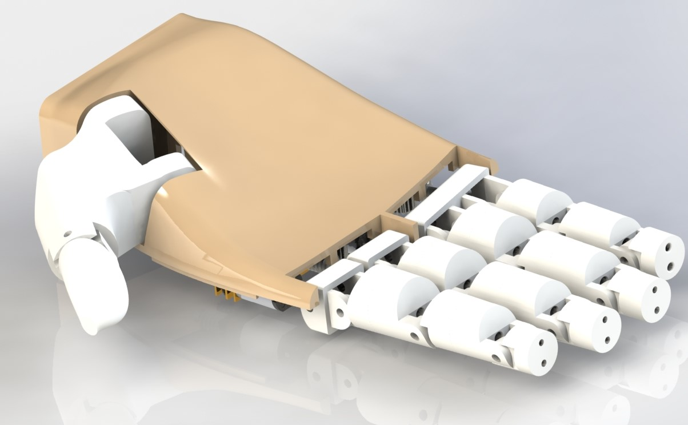

# Bionic-Arm
A low cost Bionic prosthetic arm for upper-limp amputees
For the first design iteration and process of designing the model scroll down.

3-D MODELLING USING SOLIDWORKS
Design 2.0

With the proof of concept of the design I started working on a more ergonomic design which is showcased below. The idea with the new design was 2 folds.
1.	Design should be ergonomic and functional when grabbing objects
a.	The design is inspired and closely simulated to match the dimension of an actual human palm
2.	The hand should be easy to assemble and disassemble for ease of maintenance
a.	Design principles for creating lip and hooks from injection molding is incorporated.

 
1.1 Introduction
This was the biggest challenge ahead of the team to design a hand with the most feasible design, so that it can be light weight as well have enough room for all the motors, gears, and other components. Here we decided to build the arm in such a way that it can accommodate 4 degrees of freedom (DOF).
 

Fig 1.1 Basic palm design with thumb (credits – open bionics)

There were a lot of designs currently available in the market from the very basic ones to the extremely complex ones. On research these were the ones we found to refer,
The above design is eye-catching mainly because of the thumb, as it was the most important and complicated part to design and link it with the rest of the palm.

1.2 Basic design

Taking reference from the above design, attached below was the first basic design that we were able to come up with.

Fig 1.2 First draft of the model (Transhumeral)
As shown the initial design consisted of 3 major parts,
1) The casing from the elbow, where in would be the first attachment for the arm
2) The outer arm casing in which all the motors and the mechanical components would fit in, hence the main motive was to make this portion as light in weight as possible so that the user gets added functionality.
3) The third and the last part was the palm which was the heart of the project and could be used for gripping and other activities.
1.4 Final stage CAD models
After deciding to manufacture the arm we started working cumulatively on the design and attached below are the CAD models we were able to come up with.

1.4.1 The index finger

&emsp;&emsp;&emsp;&emsp;&emsp;&emsp;&emsp;&emsp;&emsp;&emsp;&emsp;

&emsp;&emsp;&emsp;&emsp;&emsp;1.4.1.1 Index finger&emsp;&emsp;&emsp;&emsp;&emsp;&emsp;&emsp;&emsp;&emsp;&emsp;&emsp;&emsp;&emsp;&emsp;&emsp;&emsp;&emsp;&emsp;&emsp; 1.4.1.2 Exploded view

1.4.2 The middle finger
                                                                    
1.4.2.1 Middle finger                                                                    1.4.2.2 Exploded view

1.4.3 The little finger
                                                                                               
1.4.3.1 little finger                                                                    1.4.3.2 Exploded view

1.4.4 The ring finger
                                                               
1.4.4.1 Ring finger                                                                      1.4.4.2 Exploded view 

1.4.5 The Thumb
                                                      
1.4.5.1 Thumb                                                                           1.4.5.2 Exploded view
Attached above were a set of pictures imported directly from Solidworks which were designed cumulatively. Each of the five fingers consists of a normal view as well as the exploded view. The exploded view gives us an idea of the assembly to be done while assembling all the parts together.
As seen, there are tiny holes in the parts that are to be drilled through during the manufacturing in-order to allow the string-gear mechanism to play its part in automation. This will be discussed later.
1.5 The palm
The palm is basically the assembly of all the above fingers as shown. The small holes on the side of the fingers are for passing a shaft through it so that they are well attached to each other after manufacturing. Whereas the holes through the center of the fingers are for driving a string through it for governing the automating mechanism.
Here is the exploded view of the palm. It consists of all the components to be fitted inside it. The components are
1)	DC motors
2)	Worm and worm and spur gear arrangement
3)	Shafts
4)	Pulley 

 
Fig 1.5.1

